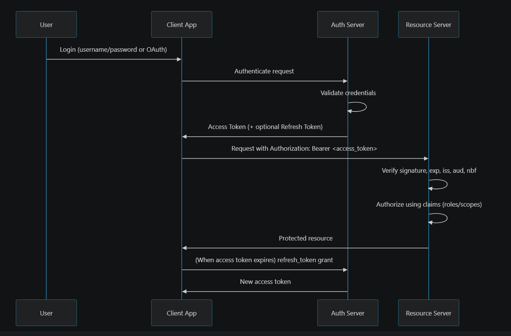

JWT - JSON Web Token
is a compact string that carries the user's identity (i.e facts/claims/users information) to the systesm.
this is usually used for authentication and authorization purposes.

JWT = Digital Passport
The spring security does the actual authentication and authorization, jwt helps the spring security
to recognize who the user is.

Modern applications needed stateless authenticaion over traditional approach of creating the session in the server side.

This is where the JWT comes into picture that, instead of storing the session everytime ,
let the server create the token and send it back to the client, every time the client sends
http request the server will detect the jwt token and allows teh user to perform teh action on the application.

JWT usually contains 3- Base64Url encoded parts
1. Header: Metadata, especially algorithm (alg) and type (typ).
2. Payload: Claims.
3. Signature: Computed from header + payload with secret/private key.

---------------------------------------------------------------------------
Mathematically (JWS style):
signature=Sign(base64url(header) + "." + base64url(payload), key)
---------------------------------------------------------------------------
Final Token would be like:
JWT=base64url(header)+"."+base64url(payload)+"."+base64url(signature)
---------------------------------------------------------------------------

Standard Claims (Know These Cold)

Registered claims commonly used:
iss: issuer
sub: subject (user id)
aud: audience (who should accept token)
exp: expiration timestamp
nbf: not before
iat: issued at
jti: unique token id (helps replay mitigation/revocation lists)

Custom claims:
roles, permissions, tenant id, scopes, org id, etc.

Algorithms: HS256 vs RS256 (Very Common Interview Topic)
HS256 (HMAC, symmetric):

Same secret for signing and verification.
Simpler.
Riskier in distributed systems because verifiers need signing secret too.
RS256 (RSA, asymmetric):

Private key signs, public key verifies.
Better separation of concerns.
Good for microservices, third-party verification, key rotation via JWKS.
Interview-friendly answer:

Internal simple system: HS256 can work.
Multi-service or external consumers: RS256/ES256 is often preferred.

